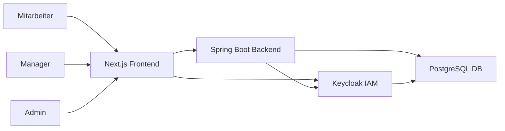
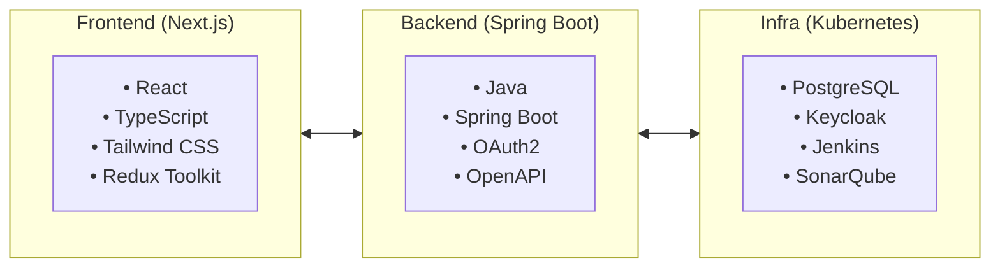

# 1. Projektkontext

## 1.1 Fachlicher Kontext

### Geschäftskontext

Das **Skill Management System** adressiert die Herausforderung der effizienten Ressourcenplanung bei EDAG. Aktuell erfolgt die Skill-Erfassung und Projektbesetzung manuell und zeitaufwändig.

### Stakeholder & Schnittstellen

#### Benutzer-Rollen

| Rolle | Schnittstelle | Beschreibung |
|-------|---------------|--------------||
| **User (Mitarbeiter)** | Web UI | Skill-Erfassung und -Pflege |
| **Manager (Projektleiter)** | Web UI | Projektmanagement und Teamplanung |
| **Admin** | Web UI | Benutzerverwaltung und Rollenanfragen |

#### System-Komponenten

| Komponente | Schnittstelle | Beschreibung |
|------------|---------------|--------------|
| **Keycloak** | OAuth2/OIDC | Authentifizierung und Autorisierung |
| **PostgreSQL** | JDBC | Datenpersistierung |
| **Spring Boot** | REST API | Backend-Logik und Business-Services |
| **Next.js** | HTTP/REST | Frontend-Anwendung |

---

## 1.2 Technischer Kontext

### Systemlandschaft

### Technologie-Stack

#### Frontend

- **Framework**: Next.js 16 (App Router)
- **UI Library**: React 19 mit TypeScript 5
- **Styling**: Tailwind CSS 3 + shadcn/ui
- **State Management**: Redux Toolkit + RTK Query
- **Internationalisierung**: next-intl
- **Authentifizierung**: NextAuth.js

#### Backend

- **Framework**: Spring Boot 3.5
- **Java Version**: Java 25 (LTS)
- **Security**: Spring Security + OAuth2 Resource Server
- **Database**: PostgreSQL mit Spring Data JPA
- **Migration**: Flyway
- **API Documentation**: OpenAPI (Swagger)

#### Infrastructure

- **Container**: Docker + Kubernetes
- **Database**: PostgreSQL 15
- **Identity Provider**: Keycloak
- **CI/CD**: Jenkins Pipeline, SonarQube

---

## 1.3 Randbedingungen

### Technische Constraints

- **Java 25**: Neueste LTS-Version für Zukunftssicherheit
- **Keycloak**: OAuth2 Authorization Code Flow (keine SSO-Anbindung in v1.0)
- **PostgreSQL**: Standard-Datenbank bei EDAG
- **Kubernetes**: Deployment in bestehender K8s-Infrastruktur

### Rechtliche Constraints

- **DSGVO**: Datenschutz-konforme Implementierung
- **Audit-Logging**: Nachvollziehbarkeit aller Änderungen
- **Security Standards**: OWASP Top 10 Compliance

---

## 1.4 Lösungsstrategie

### Architektur-Prinzipien

1. **Separation of Concerns**: Klare Trennung Frontend/Backend
2. **API-First**: RESTful API als zentrale Schnittstelle
3. **Security by Design**: OAuth2/OIDC von Anfang an
4. **Testbarkeit**: Unit- und Integrationstests
5. **Maintainability**: Clean Code und Dokumentation
