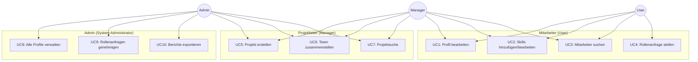

# 2. Anforderungen

## 2.1 Funktionale Anforderungen

### F1: Benutzerverwaltung & Authentifizierung

| ID | Anforderung | Priorität | Status |
|-----|-------------|-----------|---------|
| F1.1 | OAuth2/OpenID Connect Integration über Keycloak | Muss | ✅ Umgesetzt |
| F1.2 | Rollenbasierte Zugriffskontrolle (RBAC) | Muss | ✅ Umgesetzt |
| F1.3 | Automatische Benutzersynchronisation bei Keycloak-Events | Muss | ✅ Umgesetzt |
| F1.4 | Session-Management mit Token-Refresh | Muss | ✅ Umgesetzt |

**Beschreibung:**
Keycloak dient als Identity & Access Management (IAM). Login erfolgt über OAuth2 Authorization Code Flow mit EDAG-Zugangsdaten. Benutzerdaten werden bei Login automatisch synchronisiert (Webhook).

**Rollen:**
- **user** (Standard): Basis-Zugriff auf eigenes Profil und Mitarbeitersuche
- **manager**: Erweiterte Rechte für Projektmanagement und Teamplanung
- **admin**: Vollzugriff inkl. Benutzerverwaltung und Rollenanfragen-Genehmigung

---

### F2: Profilverwaltung

| ID | Anforderung | Priorität | Status |
|-----|-------------|-----------|---------|
| F2.1 | Eigenes Mitarbeiterprofil bearbeiten (Bio, Standort, Position, Verfügbarkeit) | Muss | ✅ Umgesetzt |
| F2.2 | Profilbild hochladen (via Keycloak) | Kann | ⏳ Offen |
| F2.3 | Profil anderer Mitarbeiter einsehen (schreibgeschützt) | Muss | ✅ Umgesetzt |
| F2.4 | Mehrsprachiges Profil (DE/EN) | Muss | ✅ Umgesetzt |
| F2.5 | Verfügbarkeitsstatus setzen (Verfügbar, Begrenzt, Nicht verfügbar) | Muss | ✅ Umgesetzt |

**Beschreibung:**
Jeder Mitarbeiter verfügt über ein persönliches Profil mit Stammdaten (Name, E-Mail, Position, Standort), biografischen Angaben (Bio) und Verfügbarkeitsstatus. Mitarbeiter können ihr eigenes Profil jederzeit bearbeiten, fremde Profile jedoch nur einsehen.

---

### F3: Skill-Management

| ID | Anforderung | Priorität | Status |
|-----|-------------|-----------|---------|
| F3.1 | Skills aus vordefiniertem Katalog hinzufügen (200+ Skills, 13 Kategorien) | Muss | ✅ Umgesetzt |
| F3.2 | Proficiency Score (0-100) für jedes Skill festlegen | Muss | ✅ Umgesetzt |
| F3.3 | Erfahrungsjahre pro Skill angeben | Muss | ✅ Umgesetzt |
| F3.4 | Skills bearbeiten und löschen | Muss | ✅ Umgesetzt |
| F3.5 | Skills nach Kategorien gruppiert anzeigen | Muss | ✅ Umgesetzt |
| F3.6 | Automatische Berechnung von Statistiken (Total Skills, Durchschnittsscore) | Muss | ✅ Umgesetzt |

**Beschreibung:**
Das Herzstück der Anwendung ist die Skill-Verwaltung. Mitarbeiter wählen aus einem vordefinierten Katalog (z.B. Java, React, Kubernetes) und bewerten ihre Fähigkeiten mit einem Proficiency Score (0-100) sowie Erfahrungsjahren. Die Datenbank berechnet automatisch Statistiken via Trigger (Total Skills, Durchschnittsscore).

**Skill-Kategorien:**
- Frontend Development (React, Angular, Vue.js, TypeScript...)
- Backend Development (Java, Spring Boot, Node.js, Python...)
- DevOps & Cloud (Docker, Kubernetes, AWS, Azure...)
- Datenbanken (PostgreSQL, MongoDB, Redis...)
- Testing (JUnit, Selenium, Jest...)
- Project Management (Scrum, Kanban, JIRA...)
- Weitere Kategorien (siehe Datenmodell)

---

### F4: Mitarbeiter-Discovery (Suche & Filter)

| ID | Anforderung | Priorität | Status |
|-----|-------------|-----------|---------|
| F4.1 | Volltext-Suche nach Namen, Skills, Positionen | Muss | ✅ Umgesetzt |
| F4.2 | Filter nach Skills (UND-Verknüpfung) | Muss | ✅ Umgesetzt |
| F4.3 | Filter nach Standort, Position, Verfügbarkeit | Muss | ✅ Umgesetzt |
| F4.4 | Filter nach Mindest-Erfahrungsjahren pro Skill | Sollte | ✅ Umgesetzt |
| F4.5 | Sortierung nach Relevanz, Name, Erfahrung | Sollte | ✅ Umgesetzt |
| F4.6 | Paginierung (20 Ergebnisse pro Seite) | Muss | ✅ Umgesetzt |
| F4.7 | Anzeige von Skill-Badges und Proficiency-Scores | Muss | ✅ Umgesetzt |

**Beschreibung:**
Die Mitarbeitersuche ist die zentrale Funktion für Projektleiter und HR. Sie ermöglicht das Finden passender Kandidaten basierend auf Skills, Erfahrung, Standort und Verfügbarkeit. Die Suche nutzt JPA Specifications für dynamische Filterung und ist performant durch Index-Optimierung.

**Beispiel-Use-Case:**
*"Finde alle Mitarbeiter in Fulda, die Java und Kubernetes beherrschen und verfügbar sind."*

---

### F5: Projektmanagement (Manager/Admin)

| ID | Anforderung | Priorität | Status |
|-----|-------------|-----------|---------|
| F5.1 | Projekte erstellen mit Titel, Beschreibung, Zeitraum, Status | Muss | ✅ Umgesetzt |
| F5.2 | Team-Mitglieder zu Projekten hinzufügen/entfernen | Muss | ✅ Umgesetzt |
| F5.3 | Projektdetails bearbeiten | Muss | ✅ Umgesetzt |
| F5.4 | Projektsuche mit Filtern (Status, Zeitraum, Skills) | Sollte | ✅ Umgesetzt |
| F5.5 | Eigene Projekte anzeigen (My Projects) | Muss | ✅ Umgesetzt |
| F5.6 | Automatische Team-Size-Berechnung via Trigger | Muss | ✅ Umgesetzt |

**Beschreibung:**
Manager und Admins können Projekte anlegen und Teams zusammenstellen. Jedes Projekt hat einen Status (Geplant, Aktiv, Abgeschlossen, Pausiert), einen Zeitraum und eine Liste von Mitgliedern. Die Team-Größe wird automatisch durch einen Datenbank-Trigger aktualisiert.

**Projektstatus:**
- **PLANNED**: Projekt in Planung
- **ACTIVE**: Projekt läuft
- **COMPLETED**: Projekt abgeschlossen
- **ON_HOLD**: Projekt pausiert

---

### F6: Analytics & Statistiken

| ID | Anforderung | Priorität | Status |
|-----|-------------|-----------|---------|
| F6.1 | Dashboard mit persönlichen Statistiken (Total Skills, Durchschnittsscore, Projekte) | Sollte | ✅ Umgesetzt |
| F6.2 | Activity-Log (Skill hinzugefügt, Profil aktualisiert, Projekt beigetreten) | Sollte | ✅ Umgesetzt |
| F6.3 | Skills Visualisierung (Chart) | Sollte | ✅ Umgesetzt |
| F6.4 | Projekthistorie anzeigen | Sollte | ✅ Umgesetzt |

**Beschreibung:**
Das System protokolliert automatisch alle wichtigen Aktionen in der `activities` Tabelle (via Trigger). Diese Daten werden im Dashboard visualisiert und geben Einblick in die Skill-Entwicklung und Projektbeteiligung.

---

### F7: Rollenanfragen & Administration

| ID | Anforderung | Priorität | Status |
|-----|-------------|-----------|---------|
| F7.1 | Benutzer können Manager- oder Admin-Rolle beantragen | Sollte | ✅ Umgesetzt |
| F7.2 | Admins können Rollenanfragen genehmigen/ablehnen | Sollte | ✅ Umgesetzt |
| F7.3 | Automatische Keycloak-Rollenzuweisung bei Genehmigung | Sollte | ✅ Umgesetzt |
| F7.4 | Benachrichtigung per E-Mail (optional) | Kann | ⏳ Offen |

**Beschreibung:**
Normale Benutzer können eine Rolle (Manager/Admin) beantragen. Admins sehen alle Anfragen und können sie genehmigen oder ablehnen. Bei Genehmigung wird die Rolle automatisch in Keycloak vergeben (via Admin REST API).

---

### F8: Internationalisierung (i18n)

| ID | Anforderung | Priorität | Status |
|-----|-------------|-----------|---------|
| F8.1 | Mehrsprachige UI (Deutsch, Englisch) | Muss | ✅ Umgesetzt |
| F8.2 | Sprachumschaltung zur Laufzeit | Muss | ✅ Umgesetzt |
| F8.3 | Backend-Fehler in Benutzersprache (Accept-Language Header) | Sollte | ✅ Umgesetzt |
| F8.4 | Lokalisierte Datums- und Zeitformate | Sollte | ✅ Umgesetzt |

**Beschreibung:**
Die Anwendung unterstützt Deutsch und Englisch. Die Spracheinstellung wird im Frontend über `next-intl` und im Backend über den `Accept-Language` HTTP-Header gesteuert. Fehlermeldungen und Validierungen werden in der Benutzersprache angezeigt.

---

## 2.2 Nicht-funktionale Anforderungen

### NF1: Performance

| ID | Anforderung | Zielwert | Status |
|-----|-------------|----------|---------|
| NF1.1 | Antwortzeit Backend API | < 200ms (avg) | ✅ Erreicht |
| NF1.2 | Ladezeit Frontend Initial Load | < 3s | ✅ Erreicht |
| NF1.3 | Suchergebnisse (20 Items) | < 300ms | ✅ Erreicht |
| NF1.4 | Datenbank-Queries optimiert mit Indizes | N/A | ✅ Umgesetzt |

**Maßnahmen:**
- JPA EntityGraphs zur Vermeidung von N+1 Queries
- PostgreSQL-Indizes auf Suchspalten (location, availability, skill_id)
- RTK Query Caching im Frontend
- Next.js Automatic Code Splitting

---

### NF2: Security

| ID | Anforderung | Status |
|-----|-------------|---------|
| NF2.1 | OAuth2/OpenID Connect Authentifizierung | ✅ Umgesetzt |
| NF2.2 | HTTPS-only (TLS 1.3) | ✅ Umgesetzt |
| NF2.3 | JWT Token Validation (Keycloak Introspection) | ✅ Umgesetzt |
| NF2.4 | RBAC mit @PreAuthorize auf Backend-Methoden | ✅ Umgesetzt |
| NF2.5 | CORS-Konfiguration (nur erlaubte Origins) | ✅ Umgesetzt |
| NF2.6 | Input-Validierung (Jakarta Validation + Zod) | ✅ Umgesetzt |
| NF2.7 | SQL Injection Prevention (JPA Prepared Statements) | ✅ Umgesetzt |
| NF2.8 | Secrets Management (Kubernetes Secrets) | ✅ Umgesetzt |

**Security Best Practices:**
- Passwörter werden in Keycloak mit bcrypt gehasht
- Tokens werden nur in HttpOnly Cookies gespeichert (NextAuth)
- Security Headers (X-Frame-Options, CSP, HSTS) sind konfiguriert

---

### NF3: Skalierbarkeit

| ID | Anforderung | Status |
|-----|-------------|---------|
| NF3.1 | Stateless Backend (horizontal skalierbar) | ✅ Umgesetzt |
| NF3.2 | Stateless Frontend (horizontal skalierbar) | ✅ Umgesetzt |
| NF3.3 | Kubernetes-basierte Orchestrierung | ✅ Umgesetzt |

**Skalierungsverhalten:**
- Frontend/Backend können beliebig repliziert werden (Kubernetes Replicas)
- PostgreSQL kann auf HA-Cluster erweitert werden (derzeit Single-Master)

---

### NF4: Wartbarkeit & Code-Qualität

| ID | Anforderung | Status |
|-----|-------------|---------|
| NF4.1 | Clean Code & Google Java Style Guide | ✅ Umgesetzt |
| NF4.2 | SonarQube Quality Gates | ✅ Umgesetzt |
| NF4.3 | Hexagonal Architecture (Backend) | ✅ Umgesetzt |
| NF4.4 | Feature-based Folder Structure (Frontend) | ✅ Umgesetzt |
| NF4.5 | TypeScript Strict Mode | ✅ Umgesetzt |
| NF4.6 | ESLint & Prettier (Frontend) | ✅ Umgesetzt |
| NF4.7 | Checkstyle & Spotless (Backend) | ✅ Umgesetzt |

**Code-Qualität:**
- SonarQube analysiert jeden Build
- Pipeline stoppt bei Quality Gate Fail
- Code Reviews sind obligatorisch

---

### NF5: Verfügbarkeit & Zuverlässigkeit

| ID | Anforderung | Zielwert | Status |
|-----|-------------|----------|---------|
| NF5.1 | Verfügbarkeit | 99% (geplant) | ✅ Vorbereitet |
| NF5.2 | Health Checks (Spring Actuator) | N/A | ✅ Umgesetzt |
| NF5.3 | Kubernetes Liveness/Readiness Probes | N/A | ✅ Umgesetzt |
| NF5.4 | Automatisches Deployment bei erfolgreicher Pipeline | N/A | ✅ Umgesetzt |
| NF5.5 | Rollback-Strategie (Kubernetes) | N/A | ✅ Vorbereitet |

---

### NF6: Benutzerfreundlichkeit (Usability)

| ID | Anforderung | Status |
|-----|-------------|---------|
| NF6.1 | Responsive Design | ✅ Umgesetzt |
| NF6.2 | Intuitive Navigation mit Sidebar | ✅ Umgesetzt |
| NF6.3 | Konsistente UI mit shadcn/ui Design System | ✅ Umgesetzt |
| NF6.4 | Inline-Validierung bei Formularen | ✅ Umgesetzt |
| NF6.5 | Toast-Benachrichtigungen für Erfolg/Fehler | ✅ Umgesetzt |
| NF6.6 | Barrierefreiheit (WCAG 2.1 Grundlagen) | ⚠️ Teilweise |

---

### NF7: Dokumentation

| ID | Anforderung | Status |
|-----|-------------|---------|
| NF7.1 | OpenAPI/Swagger UI für Backend-API | ✅ Umgesetzt |
| NF7.2 | README mit Setup-Anleitung | ✅ Umgesetzt |
| NF7.3 | Entwickler-Dokumentation (arc42-basiert) | ✅ Umgesetzt |
| NF7.4 | Benutzer-Dokumentation | ✅ Umgesetzt |
| NF7.5 | Code-Kommentare an komplexen Stellen | ✅ Umgesetzt |

---

## 2.3 Systemeinschränkungen (Constraints)

### Technische Einschränkungen

| Constraint | Begründung |
|-----------|------------|
| **Java 25** | Neueste LTS-Version für langfristige Wartbarkeit |
| **PostgreSQL** | Standard-Datenbank bei EDAG |
| **Keycloak Integration** | OAuth2 Authorization Code Flow für Authentifizierung |
| **Kubernetes** | Deployment in bestehender K8s-Infrastruktur |
| **On-Premise Hosting** | Keine Cloud-Nutzung aus Datenschutzgründen |

### Rechtliche Einschränkungen

| Constraint | Begründung |
|-----------|------------|
| **DSGVO-Konformität** | Verarbeitung personenbezogener Daten (Name, E-Mail, Skills) |
| **Audit-Logging** | Nachvollziehbarkeit aller Änderungen (DSGVO Art. 30) |
| **Recht auf Vergessenwerden** | Löschen aller Benutzerdaten auf Anfrage möglich |
| **Datensparsamkeit** | Nur notwendige Daten werden erfasst |

---

## 2.4 Qualitätsziele

| Priorität | Qualitätsmerkmal | Motivation |
|-----------|------------------|------------|
| 1 | **Security** | Schutz personenbezogener Daten, OAuth2-Standard |
| 2 | **Performance** | Schnelle Suche für produktiven Einsatz |
| 3 | **Wartbarkeit** | Langfristige Pflege durch EDAG IT-Team |
| 4 | **Benutzerfreundlichkeit** | Akzeptanz bei Mitarbeitern und Projektleitern |
| 5 | **Skalierbarkeit** | Wachstum auf 1000+ Mitarbeiter möglich |

---

## 2.5 Abgrenzung (Scope)

### ✅ Im Scope

- Skill-Erfassung und -Verwaltung
- Mitarbeitersuche mit Filtern
- Projektmanagement (Basic)
- Rollenbasierte Zugriffskontrolle
- Analytics & Activity-Log

### ❌ Nicht im Scope (Future Features)

- **Skill-Endorsements**: Kollegen können Skills bestätigen (geplant v2.0)
- **Automatische Skill-Empfehlungen**: ML-basierte Vorschläge (geplant v2.0)
- **Kalender-Integration**: Verfügbarkeit aus Outlook (geplant v2.0)
- **Team-Chat**: Direktnachrichten (nicht geplant)
- **Mobile App**: Derzeit nur Responsive Web (Native App möglich v3.0)
- **Skill-Zertifizierungen**: Upload von Zertifikaten (geplant v2.0)
- **Gehalts-/Budget-Daten**: Aus Datenschutzgründen nicht vorgesehen

---

## 2.6 Use-Case-Übersicht

---

## 2.7 Anforderungspriorisierung (MoSCoW)

| Kategorie | Beschreibung | Beispiele |
|-----------|--------------|-----------|
| **Must Have** | Kernfunktionen ohne die das System nicht nutzbar ist | Authentifizierung, Skill-Management, Mitarbeitersuche |
| **Should Have** | Wichtige Features, aber nicht kritisch | Projektmanagement, Analytics, Rollenanfragen |
| **Could Have** | Nice-to-have Features, die den Nutzen erhöhen | Erweiterte Statistiken, Export-Funktion |
| **Won't Have** | Bewusst ausgeschlossen für v1.0 | Skill-Endorsements, ML-Empfehlungen, Mobile App |
